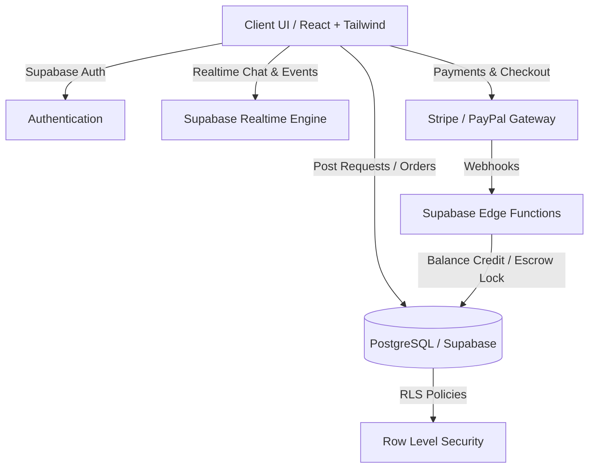

# Druxio ?

> On-demand freelance marketplace with low 5% platform fees, milestone escrow protection, real-time matchmaking, and instant workspace collaboration.

[](https://www.typescriptlang.org/)
[](https://react.dev/)
[](https://vitejs.dev/)
[](https://supabase.com/)
[](https://tailwindcss.com/)

---

## ?? Overview

Druxio is designed as a high-velocity alternative to legacy freelance platforms. Clients can post micro-tasks and receive verified expert quotes in under 2 minutes. The platform operates on a lean 5% fee model with built-in escrow payment flows, live collaboration workspaces, and automated dispute resolution.

### Key Capabilities
- **Fast Matchmaking:** Real-time request broadcast to relevant domain experts.
- **Escrow-Protected Payments:** Funds held in escrow until client approval or 48-hour auto-release.
- **Live Collaboration Workspace:** Real-time messaging, file sharing, and active order tracking.
- **Multi-Currency Wallet:** In-platform balance, Stripe/PayPal payout adapters, and transaction history.
- **Dispute Resolution Flow:** Structured mediation workflow with evidence upload.

---

## ??? Architecture



---

## ?? Tech Stack

- **Frontend:** React 18, TypeScript, Vite, Tailwind CSS, Radix UI, Framer Motion
- **Backend & Database:** Supabase (PostgreSQL, Realtime Subscriptions, Supabase Auth, Row Level Security)
- **Payment & Settlement:** Stripe, PayPal JS SDK
- **State & Data Fetching:** TanStack React Query v5
- **Routing & Forms:** React Router v6, React Hook Form, Zod

---

## ?? Getting Started

### Prerequisites
- Node.js 18+
- npm or bun

### Installation

1. Clone repository:
   ```bash
   git clone https://github.com/gekk0playz/druxio.git
   cd druxio
   ```

2. Install dependencies:
   ```bash
   npm install
   ```

3. Configure environment variables:
   ```bash
   cp .env.example .env
   ```
   Fill in your Supabase project credentials in `.env`.

4. Run development server:
   ```bash
   npm run dev
   ```

5. Build for production:
   ```bash
   npm run build
   ```

---

## ?? License
This project is licensed under the MIT License - see the LICENSE file for details.
